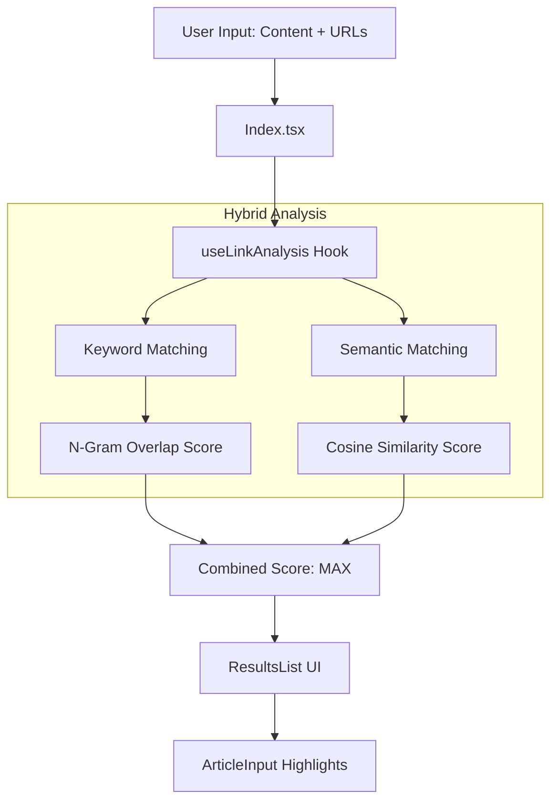

# Link Weaver Architecture

Link Weaver is a lightweight, client-side tool designed to help SEO practitioners discover internal linking opportunities using semantic relevance. This document provides a mental model of the codebase for contributors.

---

## 1. Project Purpose & Scope

### Core Value Proposition
Link Weaver eliminates the need for site crawlers or CMS access by performing semantic analysis of article content against a sitemap's URL slugs directly in the browser. It identifies high-confidence internal links that are contextually relevant to the reader, not just keyword-based.

### Target Audience
- **SEO Professionals:** Agencies and freelancers looking for fast, low-friction internal linking recommendations.
- **Content Teams:** Writers looking to link to relevant existing content during the drafting process.
- **Developers:** Interested in client-side ML (TensorFlow.js/Transformers.js) and SEO automation.

### Non-Goals
- **No Auto-Insertion:** The tool does NOT modify source code or CMS content. It provides a ranked list of suggestions for human review.
- **No Persistent Backend:** All data stays in the browser. There is no database or API storing user content.
- **No Web Crawling:** The tool relies on provided sitemaps/URLs; it does not crawl external websites.

---

## 2. Tech Stack Overview

The application is built for speed and privacy, running entirely on the client side.

| Layer | Technology | Purpose |
|-------|------------|---------|
| **Core** | [Vite](https://vitejs.dev/) + [React](https://react.dev/) | Bundling and UI framework. |
| **Logic** | [TypeScript](https://www.typescriptlang.org/) | Type safety and documentation. |
| **ML Inference** | [@xenova/transformers](https://huggingface.co/docs/transformers.js/) | Client-side embedding generation using `MiniLM-L6-v2`. |
| **UI Components** | [shadcn/ui](https://ui.shadcn.com/) | Radix UI primitives with Tailwind CSS styling. |
| **State/Data** | [TanStack Query](https://tanstack.com/query/latest) | Async state management for ML model initialization. |

---

## 3. Directory Structure

```text
src/
├── components/     # UI components (Custom + shadcn primitives)
├── hooks/          # React hooks (Analysis logic, UI state)
├── lib/            # Business logic (Algorithmic modules)
├── pages/          # Top-level route components (Index, NotFound)
└── main.tsx        # Application entry point
```

- **`lib/`**: Contains the "brain" of the app. `linkAnalyzer.ts` handles keyword extraction, while `semanticAnalyzer.ts` interfaces with the ML model.
- **`hooks/`**: `useLinkAnalysis.ts` orchestrates the data flow between the UI and the library modules.
- **`components/`**: Houses the `ArticleInput` (with its specific "Highlight Mode") and the `ResultsList`.

---

## 4. Core Data Flow

Link Weaver uses a dual-path analysis pipeline to score potential links.



1. **Trigger:** User clicks "Analyze Links".
2. **Path A (Keywords):** `analyzeInternalLinks` extracts 1/2/3-word phrases from the article and compares them to the URL slugs.
3. **Path B (Semantic):** `transformers.js` generates a vector embedding for each paragraph. Slugs are compared to these vectors using cosine similarity.
4. **Resolution:** The final score is the better of the two paths, capped at 100.

---

## 5. The Analysis Algorithm

### Keyword Matching (`linkAnalyzer.ts`)
- **N-Gram Extraction:** The text is tokenized into unigrams, bigrams, and trigrams.
- **Stop-word Filtering:** Common SEO noise terms (e.g., "how to", "best of") are filtered out using a predefined `STOP_WORDS` set.
- **Slug Parsing:** URL slugs are parsed (e.g., `/seo-strategy-2024` → `["seo", "strategy"]`) and compared for exact matches against the extracted article keywords.

### Semantic Matching (`semanticAnalyzer.ts`)
- **MiniLM-L6-v2:** A lightweight transformer model runs in a Web Worker to convert text into fixed-length numeric vectors (embeddings).
- **Cosine Similarity:** The mathematical distance between a URL slug vector and article paragraph vectors determines the semantic match quality.

---

## 6. Key React Components

### `ArticleInput.tsx`
- **Dual Mode:** Toggles between a standard `textarea` (Edit Mode) and a custom rendered `div` (Highlight Mode).
- **Highlighting Logic:** Uses `Regex` to find matched keywords in the text and wraps them in spans with index badges corresponding to the Results list.

### `ResultsList.tsx`
- **Ranking:** Sorts opportunities by the combined Score.
- **Score Badge:** Dynamically calculates a hue (Red to Green) based on the 0-100 score.
- **Semantic Indicator:** Displays a "Sparkles" icon if the score was primarily driven by semantic similarity (>50%).

---

## 7. State Management & Performance

### Centralized State
The application state is "lifted" to `src/pages/Index.tsx`. This ensures that `ArticleInput`, `KeywordCloud`, and `ResultsList` stay in sync.

### Caching Strategy (`useLinkAnalysis.ts`)
Generating embeddings is computationally expensive. To maintain 60fps performance:
- **Embedding Cache:** Article paragraph embeddings are stored in `useRef`. They are only recalculated if the article content actually changes.
- **Memoization:** Keyword mapping for highlights is wrapped in `useMemo` to prevent unnecessary regex execution during re-renders.

---

## 8. Common Contribution Scenarios

| If you want to... | Look at... |
|-------------------|------------|
| **Improve keyword rules** | `src/lib/linkAnalyzer.ts` (`STOP_WORDS`, `extractKeywords`) |
| **Change the ML model** | `src/lib/semanticAnalyzer.ts` (`init` function) |
| **Modify Highlight colors** | `src/components/ArticleInput.tsx` (`renderHighlights`) |
| **Adjust Scoring weights** | `src/hooks/useLinkAnalysis.ts` (Score combination logic) |
| **Add a new UI button** | `src/components/ui/` (radix primitives) |

### Debugging Tips
- Check the browser console; `transformers.js` logs model loading progress there.
- Use the "Omit Keyword" feature in the Result list to see how scoring recalibrates in real-time.
